# Instalación del servidor web apache. Usaremos dos dominios mediante el archivo hosts: centro.intranet y departamentos.centro.intranet. El primero servirá el contenido mediante wordpress y el segundo una aplicación en python

## Instalación de apache

Lo primero que hay que hacer antes de instalar apache es actualizar los repositorios, para ello usaremos el comando:

```sudo apt get update```
> Nota: usaremos sudo al principio de ciertos comando para ejecutarlos con permisos de root

Una vez actualizados los repositorios, procedemos a instalar apache con el siguiente comando:

```sudo apt install apache2```

Cuando hayamos instalado apache, podremos comprobar que funciona accediendo a nuestro localhost en el navegador:

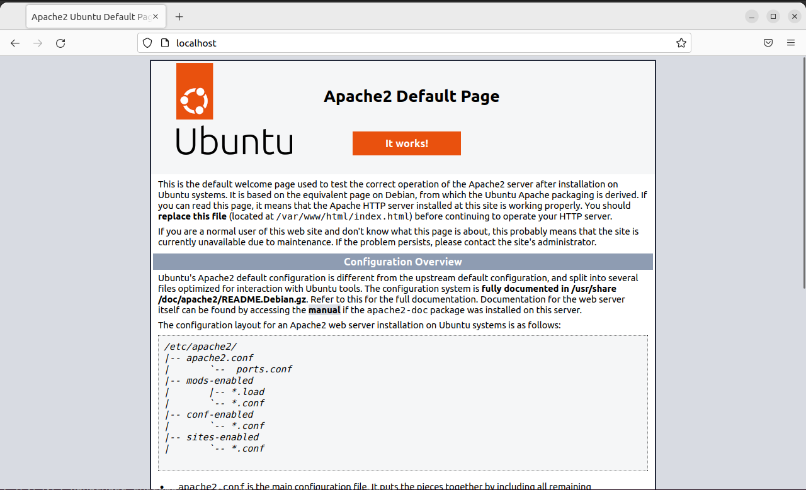

## Instalación de MySQL

Instalamos el paquete mysql-server:

```sudo apt install mysql-server```

Ejecutamos el siguiente comando para comprobar que se ha instalado correctamente:

```sudo mysql```

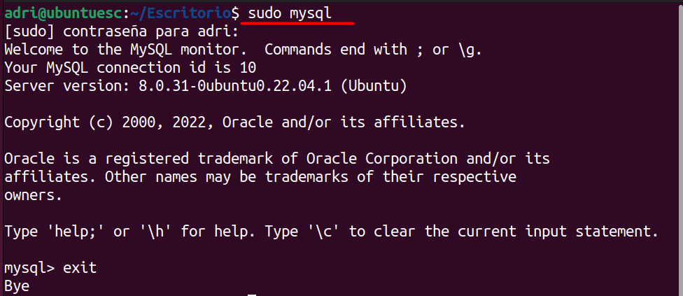

## Instalación de PHP

Instalamos los paquetes de libapache2-mod-php y php-mysql:

```sudo apt install libapache2-mod-php php-mysql```

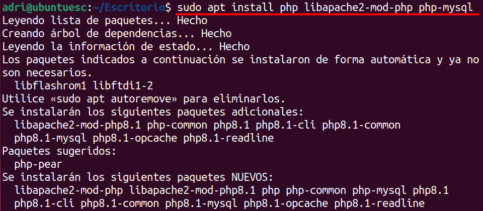

Con el siguiente comando podemos comprobar la versión de php que hemos instalado:

```php -v```

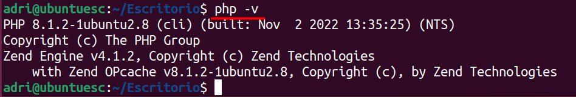

## Usaremos dos dominios mediante el archivo hosts: centro.intranet y departamentos.centro.intranet

Añadiremos los dominios centro.intranet y departamentos.centro.intranet, con la IP del localhost (127.0.0.1) en el fichero "/etc/hosts". Para ello, utilizaremos un editor de texto de linux llamado "nano" que usaremos durante todo el proyecto:

```sudo nano /etc/hosts```

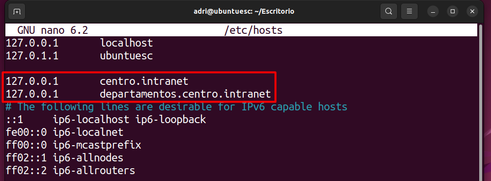

Creamos los directorios correspondientes al sitio web que queremos que se muestre cuando pongamos el dominio en el navegador:

```sudo mkdir /var/www/html/centro_intranet``` 

Listamos el directorio "/var/www/html/" para ver el directorio creado

```ls /var/www/html/```

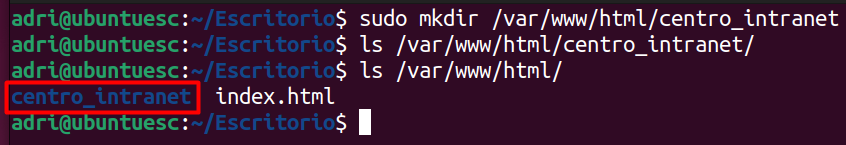

Editamos el fichero de configuración de apache del dominio centro.intranet:

```sudo nano /etc/apache2/sites-available/centro.intranet.conf``` 

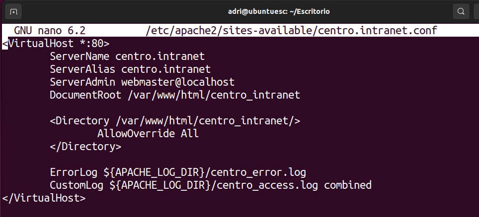

Habilitamos el sitio con el siguiente comando:

```sudo a2ensite centro.intranet```

## Crea y despliega una pequeña aplicación python para comprobar que funciona correctamente.

Para empezar, tenemos que instalar python en nuestro sistema:

```sudo apt install python3 libexpat1 -y```

Después de instalarlo, crearemos un fichero de python que ejecutaremos más adelante:

```sudo nano /var/www/html/ficheropython.py```

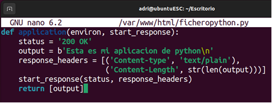

Cambiaremos los propietarios del fichero de python para que el usuario "www-data" y el grupo "www-data" tengan acceso a él y así poder ejecutarlo en nuestro servidor web:

```sudo chown www-data:www-data /var/www/html/ficheropython.py```

Cambiaremos también los permisos para que el usuario propietario tenga todos los permisos (de ahí el primer 7 del parámetro de chmod), para que el grupo propietario tenga todos los permisos (de ahí el segundo 7 del parámetro de chmod), y, por último, para que otros tengan permisos de lectura y ejecución, pero no de escritura (de ahí el 5 en el parámetro de chmod):

```sudo chmod 775 /var/www/html/ficheropython.py```

Editaremos el fichero /etc/apache2/sites-enabled/000-default.conf y añadiremos la siguiente línea marcada en la imagen para ejecutar ficheros python en la ruta /wsgi:

```sudo nano /etc/apache2/sites-enabled/000-default.conf```

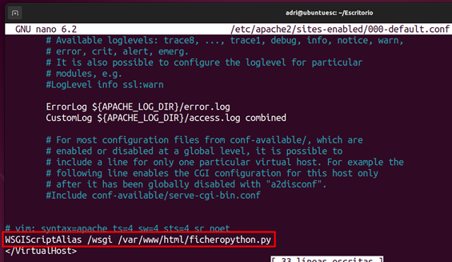

# Activación del módulo WSGI

```sudo apt install libapache2-mod-wsgi-py3 -y```

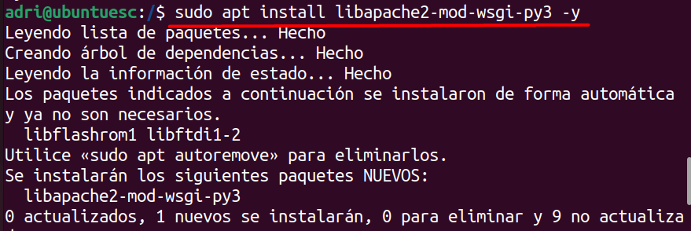

Reiniciamos el servicio de apache

```sudo systemctl restart apache2```

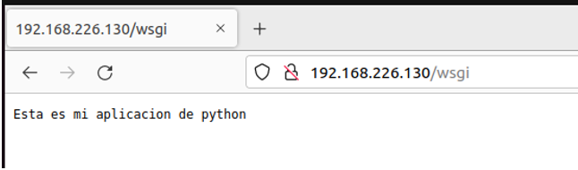

## Adicionalmente protegeremos el acceso a la aplicación python mediante autenticación

Para ello, primero instalaremos el siguiente paquete de apache2:

```sudo apt-get install apache2-utils```

Creamos un nuevo usuario, en este caso "adri", y almacenamos la contraseña en el fichero "httpasswd"

```htpasswd -c /etc/apache2/.htpasswd adri```

Nos pedirá una contraseña de autenticación:

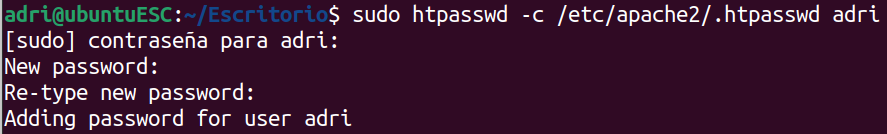

Añadiremos las estas líneas dentro del siguiente fichero de configuración:

```sudo nano /etc/apache2/sites-enabled/000-default.conf```

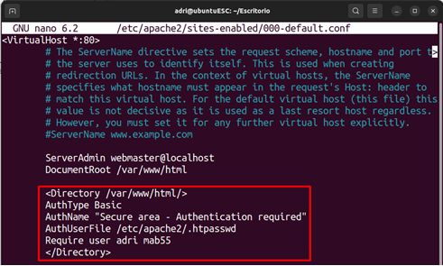

Comprobaremos que podemos acceder al dominio "departamentos.centro.intranet", donde ejecutaremos la aplicación de python:


Y, finalmente, ingresamos con el usuario que hemos creado anteriormente:

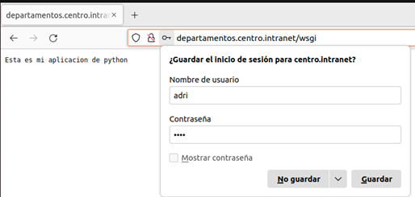

## Instalación de WORDPRESS

### Creación de la base de datos y usuario

Creamos la base de datos, la cual llamaremos "wordpress", con la siguiente línea de comandos dentro de MySQL:

```CREATE DATABASE wordpress DEFAULT CHARACTER SET utf8 COLLATE utf8_unicode_ci;```

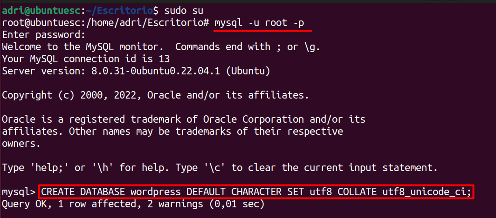

Creamos también el usuario:

```CREATE USER 'usuario'@'%' IDENTIFIED WITH mysql_native_password BY 'contraseña';```

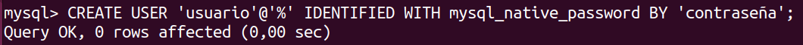

Le damos los permisos necesarios sobre la base de datos al usuario:

```GRANT ALL ON wordpress.* TO 'usuario'@'%';```

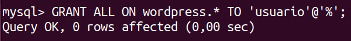

Solicitamos a MySQL que vuelva a leer la tabla de privilegios, ya que, acabamos de cambiar los permisos:

```FLUSH PRIVILEGES;```

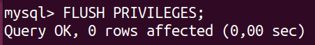

## Instalamos las extensiones de php adicionales:

Para ello utilizaremos el siguiente comando:

```sudo apt install php-curl php-gd php-mbstring php-xml php-xmlrpc php-soap php-intl php-zip```

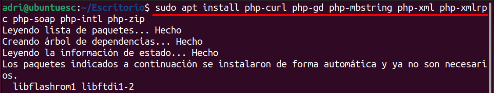

También necesitaremos instalar "curl" para descargar aplicaciones:

Para ello, accedemos al directorio "/tmp" donde instalaremos "curl":

```cd /tmp```

Instalamos "curl" con el siguiente comando:

```sudo apt install curl```

Descargamos wordpress con el comando:

```curl -O https://wordpress.org/lastest.tar.gz```

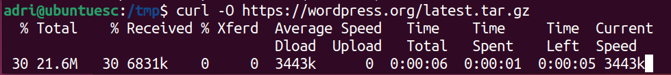

Descomprimimos el archivo:

```tar xzvf lastest.tar.gz```

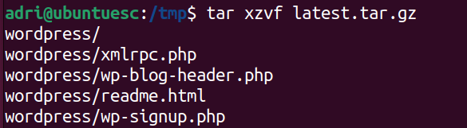

Creamos el archivo .htaccess:

```touch /tmp/wordpress/.htaccess```


Copiamos la plantilla de configuración al fichero config.php:

```cp /tmp/wordpress/wp-config-sample.php /tmp/wordpress/wp-config.php```

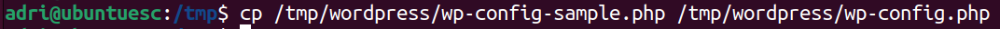

Creamos el directorio para actualizaciones de wordpress:

```mkdir /tmp/wordpress/wp-content/upgrade```


Copiamos la aplicación wordpress a la carpeta web para el proyecto:

```sudo cp -a /tmp/wordpress/. /var/www/html/centro_intranet```


Cambia los permisos de la carpeta web:

```sudo chown -R www-data:www-data /var/www/html/centro_intranet```

```sudo find /var/www/html/base/ -type d -exec chmod 750 {} \;```

```sudo find /var/www/html/base/ -type f -exec chmod 640 {} \;```

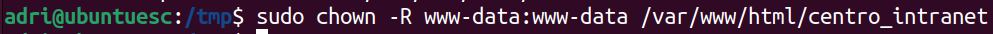

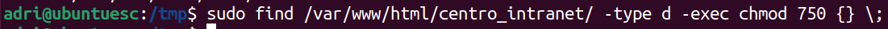

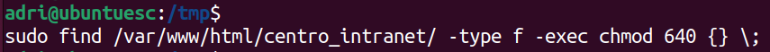

Consigue los código para securizar tu instalación:

```curl -s https://api.wordpress.org/secret-key/1.1/salt/```

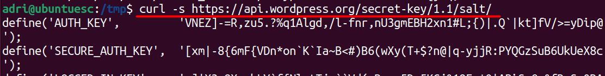

Editar el fichero de configuración de WordPress y añadimos los códigos, además del nombre, usuario y contraseña de la base de datos:

```sudo nano /var/www/html/centro_intranet/wp-config.php```

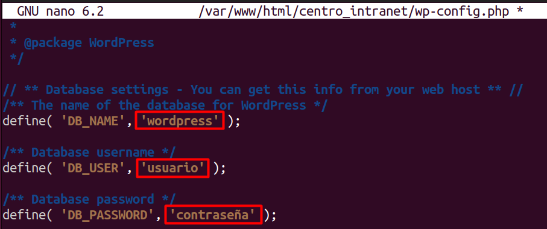

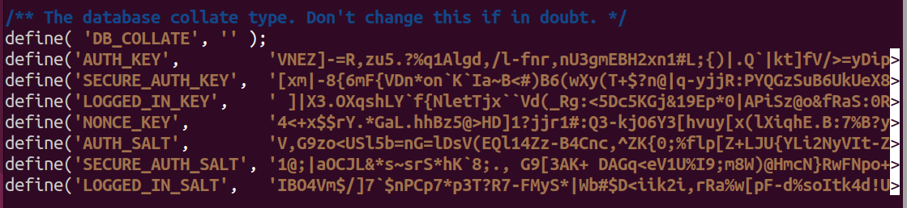


Comprobamos si todo ha funcionado entrando en el dominio correspondiente para wordpress en el navegador:

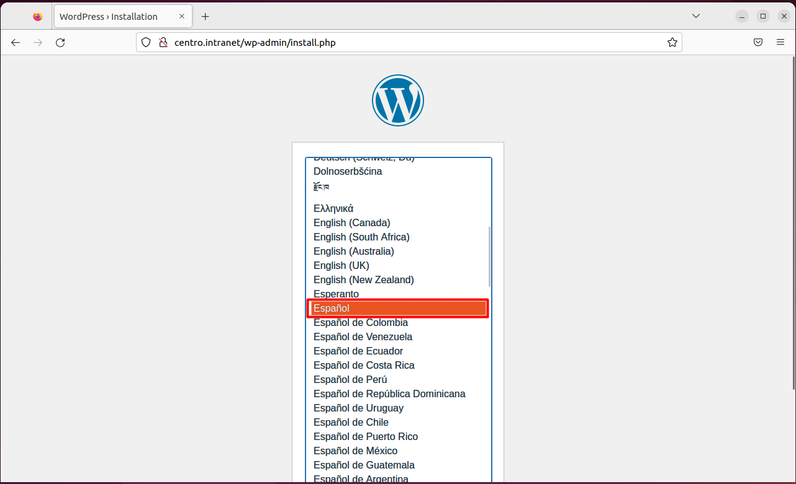

Una vez que funcione wordpress, nos registramos:

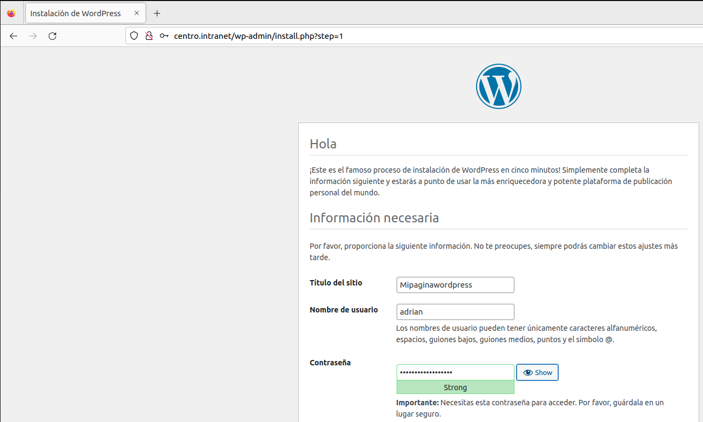

Una vez registrados correctamente nos aparecerá el panel principal de wordpress:

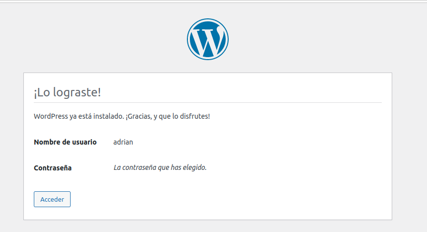

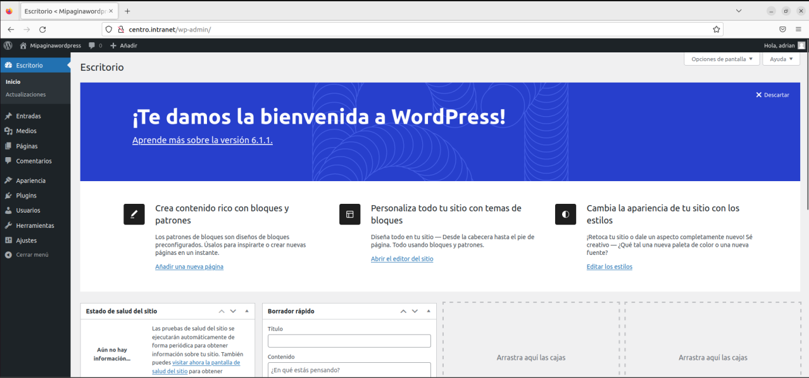
 
## Instalación y configuración de AWSTATS

Para instalarlo ejecutamos el siguiente comando:

```sudo apt-get install awstats```

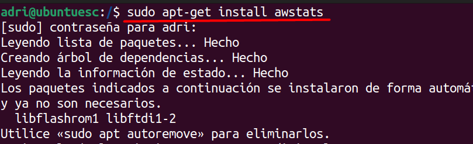

A continuación, habrá que habilitar el módulo CGI en Apache.

```sudo a2enmod cgi```

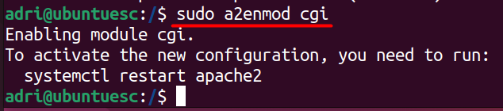

Ahora, reiniciamos Apache para reflejar los cambios:

```sudo /etc/init.d/apache2 restart```

# Configuración AWSTATS

Creamos un archivo de configuración para el dominio del que queramos ver las estadísticas:

```sudo cp /etc/awstats/awstats.conf /etc/awstats/awstats.test.com.conf```

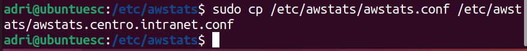

Editamos el fichero de configuración:

```sudo nano /etc/awstats/awstats.centro.intranet.conf```

Cambiamos el "SiteDomain" a "centro.intranet":

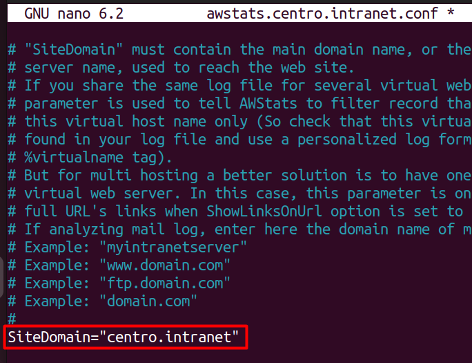

Para crear las estadísticas iniciales, ejecutamos el siguiente comando:

```sudo /usr/lib/cgi-bin/awstats.pl -config=centro.intranet -update```

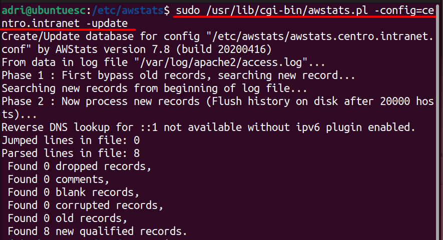

A continuación, configuramos Apache2 para que muestre estas estadísticas. Copiamos el contenido de la carpeta «cgi-bin» en el directorio raíz del documento por defecto de su instalación de Apache. Por defecto se encuentra en la carpeta «/usr/lib/cgi-bin».

```sudo cp -r /usr/lib/cgi-bin /var/www/html/```

```sudo chown www-data:www-data /var/www/html/cgi-bin/```

```sudo chmod -R 755 /var/www/html/cgi-bin/```

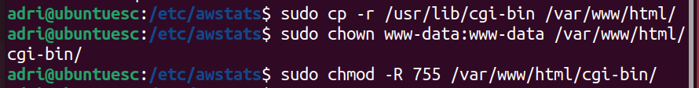

Accedemos a mi AWStats poniendo lo siguiente en la url del navegador:

http://centro.intranet/cgi-bin/awstats.pl?config=centro.intranet.com

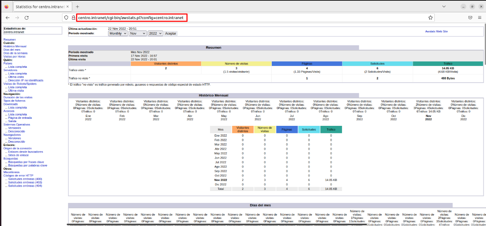

## Configuramos Cron para actualizar los registros de AWSTATS

Editamos el fichero "/etc/crontab"

Añadimos la siguiente línea que le dice a AWStats que actualice cada diez minutos:

```*/10 * * * * * root /usr/lib/cgi-bin/awstats.pl -config=centro.intranet -update```


