# Práctica 1 - Servidor alojamiento web
Se pide las instalación, configuración y puesta en marcha de un servidor que ofrezca servicio de alojamiento web configurable:

-	Se dará alojamiento a páginas web tanto estáticas como dinámicas con “php”  
-	Los clientes dispondrán de un directorio de usuario con una página web por defecto.  
-	Además contarán con una base de datos sql que podrán administrar con phpmyadmin  
-	Los clientes podrán acceder mediante ftp para la administración de archivos configurando adecuadamente TLS  
-	Se habilitará el acceso mediante ssh y sftp.  
-	Se automatizará mediante el uso de scripts:  
    - La creación de usuarios y del directorio correspondiente para el alojamiento web 
    - Host virtual en apache 
    - Creación de usuario del sistema para acceso a ftp, ssh, smtp, ... 
    - Se creará un subdominio en el servidor DNS con las resolución directa e inversa
    - Se creará una base de datos además de un usuario con todos los permisos sobre dicha base de datos (ALL PRIVILEGES)
    - Se habilitará la ejecución de aplicaciones Python con el servidor web 


## Se dará alojamiento a páginas web tanto estáticas como dinámicas con “php”  
Para ello crearemos un fichero llamado index.php, que contendrá contenido en php que se podrá visualizar.
Este fichero tendrá que estar en un directorio personal que hayamos creado en la ruta "/var/www/html/", que es donde se almacenarán los ficheros html alojados para el localhost.

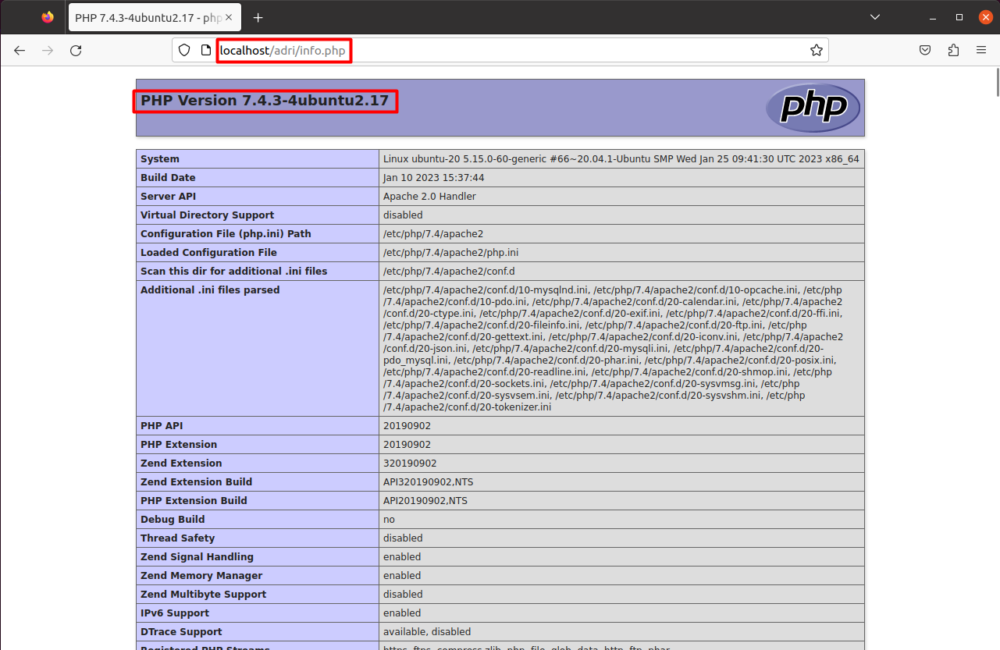

## Los clientes dispondrán de un directorio de usuario con una página web por defecto. 
Daremos un alojamiento web a los usuarios que vayamos creando, como por ejemplo, el que yo he creado, el usuario "dnsadri".

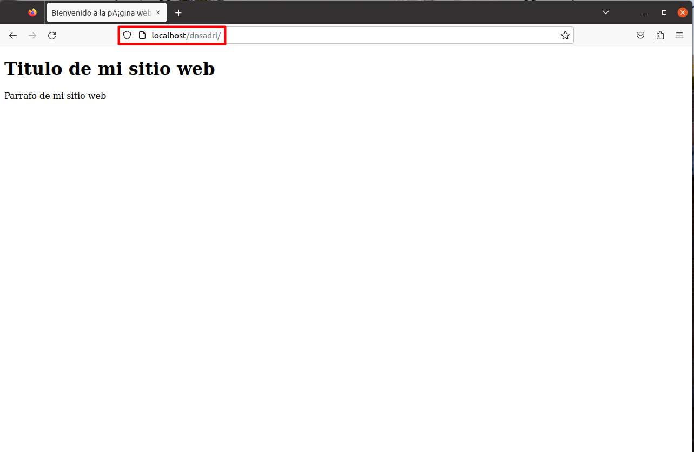

## Además contarán con una base de datos sql que podrán administrar con phpmyadmin
Con los siguientes comando que serán usados más tarde en el script que automatizará todo, podremos crear una base de datos en MySQL con privilegios en ella para los usuarios que creemos:

``` 
mysql -u root -e "CREATE DATABASE usuario;"

mysql -u root -e "USE usuario;"

mysql -u root -e "CREATE USER 'usuario'@'localhost' IDENTIFIED BY '12345';GRANT ALL PRIVILEGES ON usuario.* TO 'usuario'@'localhost';"
``` 

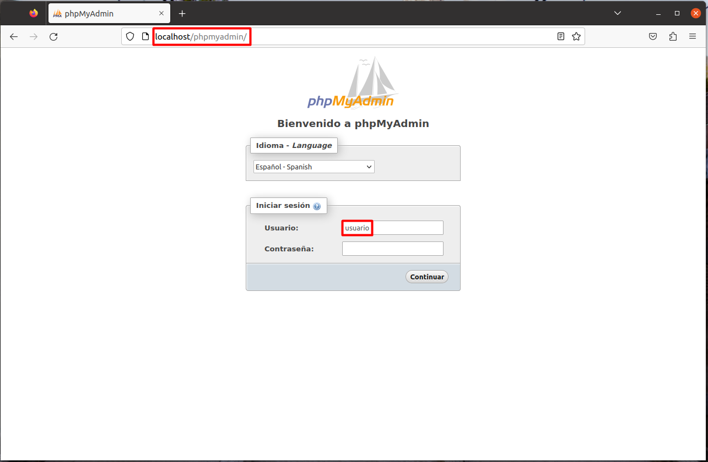

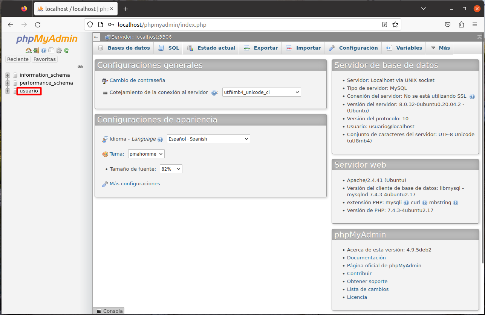

## Los clientes podrán acceder mediante ftp para la administración de archivos configurando adecuadamente TLS  

Para ello, tendremos que instalar el paquete vsftpd:

``` sudo apt-get install vsftpd ```

Editaremos su fichero de configuración:

``` sudo nano /etc/vsftpd.conf ```

Tendríamos que descomentar la línea de write_enable=YES:

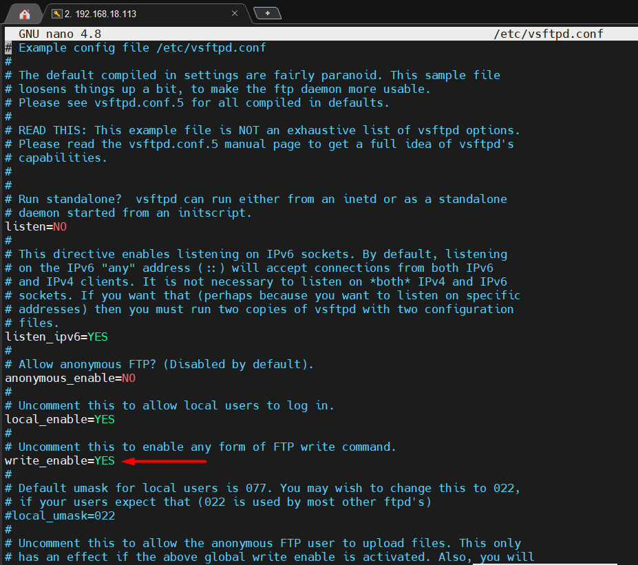

Además, tendremos que poner las dos primeras líneas marcadas para configurar los certificados, escribir "YES" en la línea de ssl_enable y, por último, escribir las siguientes líneas para habilitar el TLS:

```
force_local_data_ssl=YES
force_local_logins_ssl=YES
```

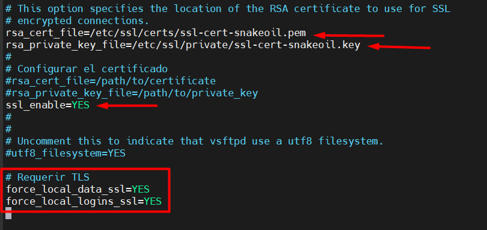

Después de esto, escribiremos el siguiente comando para generar los certificados:

```sudo openssl req -x509 -nodes -days 365 -newkey rsa:2048 -keyout /etc/ssl/private/ssl-cert-snakeoil.key -out /etc/ssl/certs/ssl-cert-snakeoil.pem ```

Finalmente, probaremos a entrar mediante FTP con el filezilla, lo haremos con un usuario de prueba que he creado.

Para ello, escribiremos la direccion IP del servidor, el puerto 21 que es el de FTP, el usuario y la contraseña 

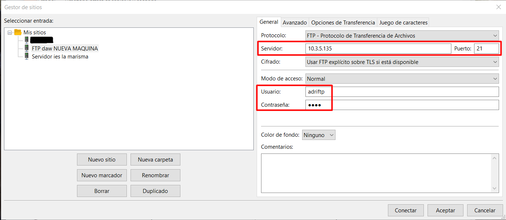

Con ello, accederemos a su directorio home en la máquina linux, donde probaremos a subir una foto para ver que la conexión funciona correctamente:

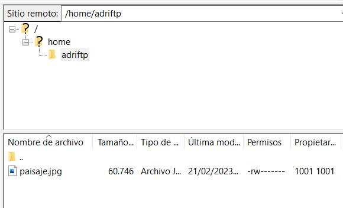


## Se habilitará el acceso mediante ssh.

Usaremos una aplicación externa para probar la conexión por shh, utilizaremos Mobaxterm:

Crearemos una nueva sesión por SSH en el puerto 22 con la dirección IP de la máquina:

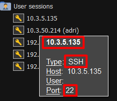

Iniciamos sesión con alguno de los usuarios:

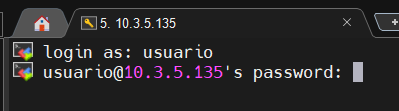

Y tendremos acceso completo a la máquina:

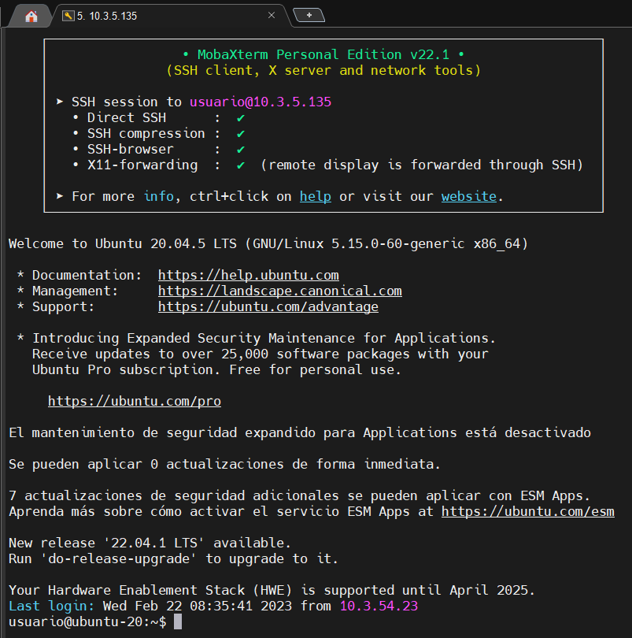

## Crea y despliega una pequeña aplicación python para comprobar que funciona correctamente.

Para empezar, tenemos que instalar python en nuestro sistema:

```sudo apt install python3 libexpat1 -y```

Instalamos Apache y mod_wsgi:   

```apt-get install apache2 apache2-utils ssl-cert libapache2-mod-wsgi -y```

Después de instalarlo, crearemos un fichero de python que ejecutaremos más adelante:

```sudo nano /var/www/html/wsgy.py```

```
def application(environ,start_response):
    status = '200 OK'
    html = '<html>\n' \
           '<body>\n' \
           '<div style="width: 100%; font-size: 40px; font-weight: bold; text-align: center;">\n' \
           'Bienvenido a mi aplicacion de python\n' \
           '</div>\n' \
           '</body>\n' \
           '</html>\n'
    response_header = [('Content-type','text/html')]
    start_response(status,response_header)
    return [html]
```

Cambiaremos los propietarios del fichero de python para que el usuario "www-data" y el grupo "www-data" tengan acceso a él y así poder ejecutarlo en nuestro servidor web:

```sudo chown www-data:www-data /var/www/html/wsgy.py```

Cambiaremos también los permisos para que el usuario propietario tenga todos los permisos:

```sudo chmod 775 /var/www/html/wsgy.py```

A continuación, crea un archivo de configuración del host virtual de Apache para servir este archivo a través del protocolo HTTP.

```sudo nano /etc/apache2/conf-available/wsgi.conf```

Añadimos la siguiente línea:

```WSGIScriptAlias /wsgi /var/www/html/wsgy.py```

Guardamos y cerramos el archivo. A continuación, activamos la configuración de mod-wsgi y reiniciamos el servicio de Apache con los siguientes comandos:

```
a2enconf wsgi
systemctl restart apache2
```

Finalmente, comprobamos que podemos ejecutarlo en el localhost:

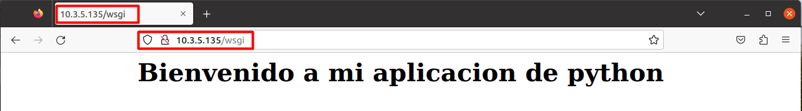


## Instalación y configuración de DNS
Instalamos el paquete bind9 para crear el DNS

```sudo apt install -y bind9```

Comprobamos que se ha instalado correctamente y está activo con el siguiente comando:

```sudo systemctl status bind9```

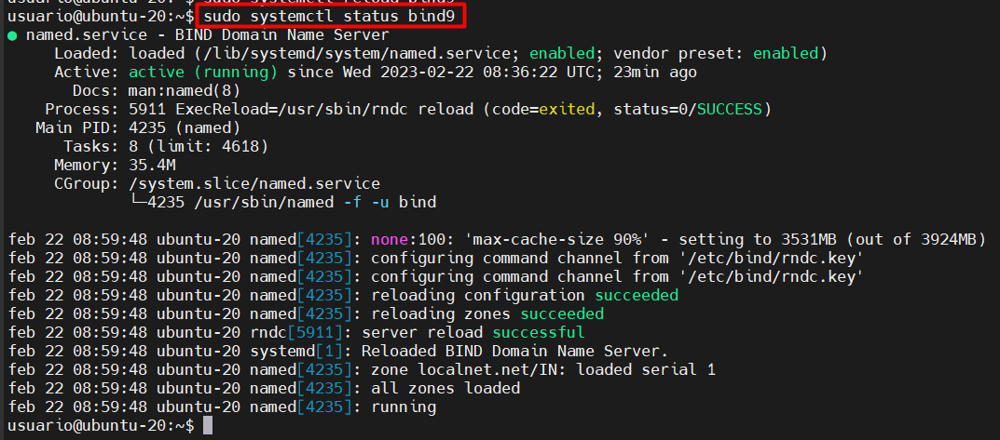

Configuramos los clientes de red para usar el servicio DNS Bind:

```
network:
  ethernets:
    enp0s3:
      dhcp4: true
      nameservers:
        addresses: [10.3.5.135]
  version: 2
```

Guardamos los cambios, cerramos el archivo y aplicamos los cambios con el siguiente comando de netplan:

```sudo netplan apply```

Editamos el fichero /etc/default/named

```sudo nano /etc/default/named```

Y le añadimos el parámetro -4 a la siguiente línea:

```OPTIONS="-u bind -4"```

Reiniciamos el servicio:

```sudo systemctl reload bind9```

## Si trabajamos con un servidor DNS local, como el de este ejemplo, no funcionará la capa de seguridad DNSSEC, así que debemos desactivarla. Para ello editamos el archivo named.conf.options:

```sudo nano /etc/bind/named.conf.options```

Buscamos la directiva dnssec-validation y cambiamos su valor por "no":

```dnssec-validation no;```

## Editamos el archivo named.conf.options para la resolución de nombres de Internet (forwarding)

```sudo nano /etc/bind/named.conf.options```

```      
        forwarders {
                8.8.8.8;
                8.8.4.4;
        };
```

### Configuración de zonas o dominios

Para configurar un dominio o zona, creamos un archivo de zona para dicho dominio, normalmente utilizando el dominio como parte del nombre del archivo. En este caso vamos a crear el archivo de zona para el dominio de red local localnet.net

```sudo nano /etc/bind/db.localnet.net```

Escribiremos los registros de los servidores de nombres del dominio que queramos tener, crearemos, por ejemplo dns1.localnet.net, con la dirección IP de la máquina (10.3.5.135)

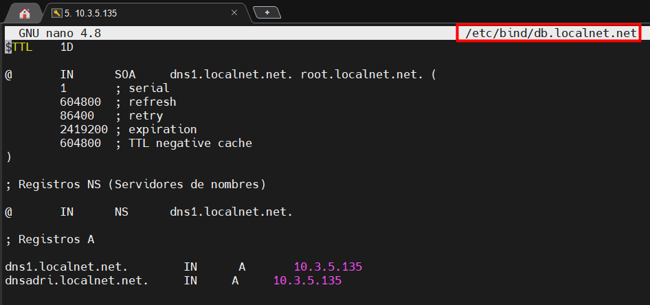

Guardamos los cambios y cerramos el archivo, comprobamos que la configuración es correcta con el siguiente comando:

```named-checkzone localnet.net /etc/bind/db.localnet.net```

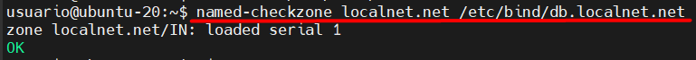

Para que esta configuración sea tenida en cuenta por el servicio DNS Bind será necesario incluirla desde el archivo named.conf.default-zones, así que lo editamos con el siguiente comando

```sudo nano /etc/bind/named.conf.default-zones```

Añadimos al final del archivo las siguientes líneas:

```
zone "localnet.net" IN {
        type master;
        file "/etc/bind/db.localnet.net";
};
```

Guardamos el archivo y recargamos el servicio:

```sudo systemctl reload bind9```

## Probamos el servicio DNS Bind del servidor haciendo ping con el DNS

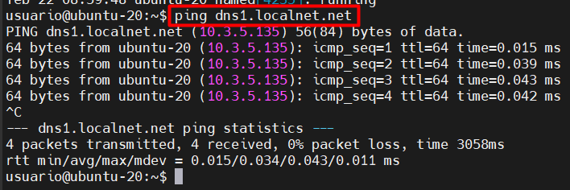

## Configuramos la resolución inversa con el servidor DNS Bind

Creamos el archivo de zona correspondiente a nuestra dirección de red:

```sudo nano /etc/bind/db.5.3.10```

Añadiremos los siguientes registros al final del fichero:

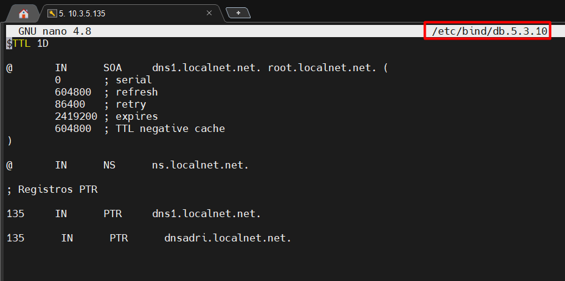
