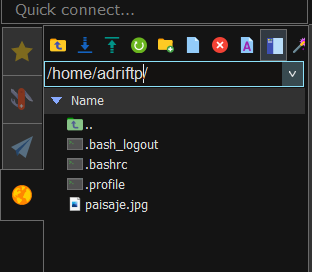

# Práctica 1 - Servidor alojamiento web
Se pide las instalación, configuración y puesta en marcha de un servidor que ofrezca servicio de alojamiento web configurable:

-	Se dará alojamiento a páginas web tanto estáticas como dinámicas con “php”  
-	Los clientes dispondrán de un directorio de usuario con una página web por defecto.  
-	Además contarán con una base de datos sql que podrán administrar con phpmyadmin  
-	Los clientes podrán acceder mediante ftp para la administración de archivos configurando adecuadamente TLS  
-	Se habilitará el acceso mediante ssh y sftp.  
-	Se automatizará mediante el uso de scripts:  
    - La creación de usuarios y del directorio correspondiente para el alojamiento web 
    - Host virtual en apache 
    - Creación de usuario del sistema para acceso a ftp, ssh, smtp, ... 
    - Se creará un subdominio en el servidor DNS con las resolución directa e inversa
    - Se creará una base de datos además de un usuario con todos los permisos sobre dicha base de datos (ALL PRIVILEGES)
    - Se habilitará la ejecución de aplicaciones Python con el servidor web 


## Se dará alojamiento a páginas web tanto estáticas como dinámicas con “php”  
Para ello crearemos un fichero llamado index.php, que contendrá contenido en php que se podrá visualizar.
Este fichero tendrá que estar en un directorio personal que hayamos creado en la ruta "/var/www/html/", que es donde se almacenarán los ficheros html alojados para el localhost.


## Los clientes dispondrán de un directorio de usuario con una página web por defecto. 
Daremos un alojamiento web a los usuarios que vayamos creando, como por ejemplo, el que yo he creado, el usuario "dnsadri".


## Además contarán con una base de datos sql que podrán administrar con phpmyadmin
Con los siguientes comando que serán usados más tarde en el script que automatizará todo, podremos crear una base de datos en MySQL con privilegios en ella para los usuarios que creemos:

``` 
mysql -u root -e "CREATE DATABASE usuario;"

mysql -u root -e "USE usuario;"

mysql -u root -e "CREATE USER 'usuario'@'localhost' IDENTIFIED BY '12345';GRANT ALL PRIVILEGES ON usuario.* TO 'usuario'@'localhost';"
``` 


## Los clientes podrán acceder mediante ftp para la administración de archivos configurando adecuadamente TLS  

Para ello, tendremos que instalar el paquete vsftpd:

``` sudo apt-get install vsftpd ```

Editaremos su fichero de configuración:

``` sudo nano /etc/vsftpd.conf ```

Tendríamos que descomentar la línea de write_enable=YES:


Además, tendremos que poner las dos primeras líneas marcadas para configurar los certificados, escribir "YES" en la línea de ssl_enable y, por último, escribir las siguientes líneas para habilitar el TLS:

```
force_local_data_ssl=YES
force_local_logins_ssl=YES
```


Después de esto, escribiremos el siguiente comando para generar los certificados:

```sudo openssl req -x509 -nodes -days 365 -newkey rsa:2048 -keyout /etc/ssl/private/ssl-cert-snakeoil.key -out /etc/ssl/certs/ssl-cert-snakeoil.pem ```

Finalmente, probaremos a entrar mediante FTP con el filezilla, lo haremos con un usuario de prueba que he creado.

Para ello, escribiremos la direccion IP del servidor, el puerto 21 que es el de FTP, el usuario y la contraseña 


Con ello, accederemos a su directorio home en la máquina linux, donde probaremos a subir una foto para ver que la conexión funciona correctamente:





## Se habilitará el acceso mediante ssh.

Usaremos una aplicación externa para probar la conexión por shh, utilizaremos Mobaxterm:

Crearemos una nueva sesión por SSH en el puerto 22 con la dirección IP de la máquina:


Iniciamos sesión con alguno de los usuarios:


Y tendremos acceso completo a la máquina:


## Crea y despliega una pequeña aplicación python para comprobar que funciona correctamente.

Para empezar, tenemos que instalar python en nuestro sistema:

```sudo apt install python3 libexpat1 -y```

Instalamos Apache y mod_wsgi:   

```apt-get install apache2 apache2-utils ssl-cert libapache2-mod-wsgi -y```

Después de instalarlo, crearemos un fichero de python que ejecutaremos más adelante:

```sudo nano /var/www/html/wsgy.py```

```
def application(environ,start_response):
    status = '200 OK'
    html = '<html>\n' \
           '<body>\n' \
           '<div style="width: 100%; font-size: 40px; font-weight: bold; text-align: center;">\n' \
           'Bienvenido a mi aplicacion de python\n' \
           '</div>\n' \
           '</body>\n' \
           '</html>\n'
    response_header = [('Content-type','text/html')]
    start_response(status,response_header)
    return [html]
```

Cambiaremos los propietarios del fichero de python para que el usuario "www-data" y el grupo "www-data" tengan acceso a él y así poder ejecutarlo en nuestro servidor web:

```sudo chown www-data:www-data /var/www/html/wsgy.py```

Cambiaremos también los permisos para que el usuario propietario tenga todos los permisos:

```sudo chmod 775 /var/www/html/wsgy.py```

Finalmente, comprobamos que podemos ejecutarlo en el localhost:


