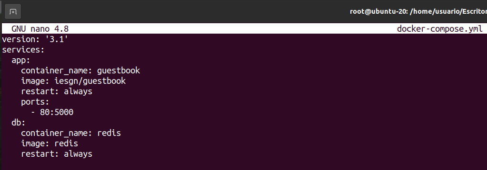

# Proyecto Docker

Instalamos docker y comprobamos que funciona correctamente

```apt install docker.io ```


# Práctica 2 

  - Lleva a cabo la práctica descrita en el primer artículo  
Ejecuta la imagen "hello-world"


Muestra las imágenes Docker instaladas  


Muestra los contenedores Docker  


  - Lleva a cabo la práctica descrita en el segundo artículo  
Edita el fichero Dockerfile 


Construye el contenedor  


Ejecútalo  


Create una cuenta en hub.docker.com  


Publícalo  


# Práctica 3

Descarga la imagen de ubuntu


Descarga la imagen de hello-world


Descarga la imagen nginx


Muestra un listado de todas la imágenes


Ejecuta un contenedor hello-world y dale nombre “myhello1”


Ejecuta un contenedor hello-world y dale nombre “myhello2”


Ejecuta un contenedor hello-world y dale nombre “myhello3”


Muestra los contenedores que se están ejecutando


Para el contenedor "myhello1”


Para el contenedor "myhello2”


Borra el contenedor “myhello1”


Muestra los contenedores que se están ejecutando.


Borra todos los contenedores


# Práctica 4 

## Ejemplo 1: Despliegue de la aplicación Guestbook

La aplicación guestbook por defecto utiliza el nombre redis para conectarse a la base de datos, por lo tanto debemos nombrar al contenedor redis con ese nombre para que tengamos una resolución de nombres adecuada.

Los dos contenedores tienen que estar en la misma red y deben tener acceso por nombres (resolución DNS) ya que de principio no sabemos que ip va a coger cada contenedor. Por lo tanto vamos a crear los contenedores en la misma red:

```docker network create red_guestbook```


Para ejecutar los contenedores:

```docker run -d --name redis --network red_guestbook -v /opt/redis:/data redis redis-server --appendonly yes```


```docker run -d -p 80:5000 --name guestbook --network red_guestbook iesgn/guestbook```


-  Aplicación Guestbook funcionando:


## Ejemplo 2: Despliegue de la aplicación Temperaturas

El microservicio frontend se conecta a backend usando el nombre temperaturas-backend. Por lo tanto el contenedor con el micorservicio backend tendrá ese nombre para disponer de una resolución de nombres adecuada en el dns.

Vamos a crear una red para conectar los dos contenedores:

```docker network create red_temperaturas```

Para ejecutar los contenedores:

```docker run -d --name temperaturas-backend --network red_temperaturas iesgn/temperaturas_backend```

```docker run -d -p 80:3000 --name temperaturas-frontend --network red_temperaturas iesgn/temperaturas_frontend```


-  Aplicación Temperaturas funcionando:


## Ejemplo 3: Despliegue de Wordpress + mariadb

Para la instalación de WordPress necesitamos dos contenedores: la base de datos (imagen mariadb) y el servidor web con la aplicación (imagen wordpress). Los dos contenedores tienen que estar en la misma red y deben tener acceso por nombres (resolución DNS) ya que de principio no sabemos que ip va a coger cada contenedor. Por lo tanto vamos a crear los contenedores en la misma red:

```docker network create red_wp```


Siguiendo la documentación de la imagen mariadb y la imagen wordpress podemos ejecutar los siguientes comandos para crear los dos contenedores:


-  Aplicación Wordpress funcionando:


# Práctica 5

Instalamos el paquete docker-compose:

```apt install docker-compose```


## Ejemplo 1: Despliegue de la aplicación Guestbook

En el fichero docker-compose.yml vamos a definir el escenario. 

Creamos un directorio para la aplicación guestbook en "/home/usuario/Escritorio/guestbook", y ahí creamos el fichero docker-compose.yml y añadimos las siguientes líneas:




El programa docker-compose se debe ejecutar en el directorio donde este ese fichero.


-  Aplicación Guestbook funcionando:


## Ejemplo 2: Despliegue de la aplicación Temperaturas

En este caso el fichero docker-compose.yml estará en la ruta "/home/usuario/Escritorio/temperaturas" y tendrá esta forma:


Ejecutamos el programa docker-compose desde el directorio de la aplicación


-  Aplicación Temperaturas funcionando:


## Ejemplo 3: Despliegue de Wordpress + mariadb

Para la ejecución de wordpress el fichero docker-compose.yml tendrá el siguiente contenido:


