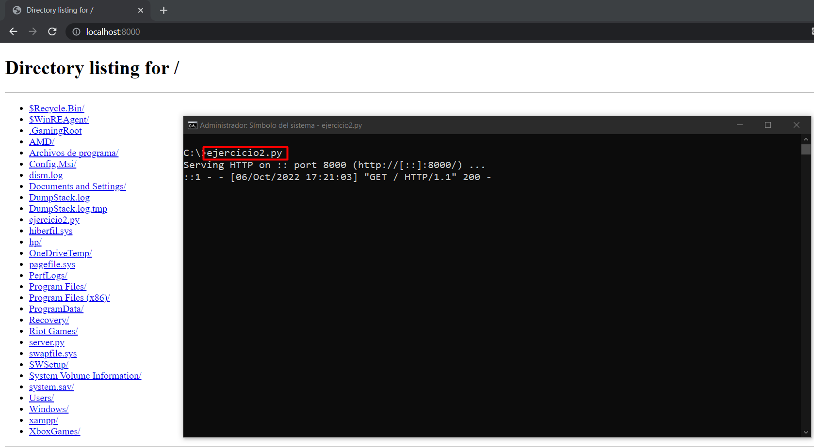

# Simple web server (ejemplo 1)
https://docs.python.org/3/library/http.server.html

python -m http.server 8000

# http server (ejemplo 2)
https://github.com/python/cpython/blob/main/Lib/http/server.py

